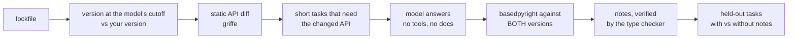

# since-cutoff

<!-- mcp-name: io.github.MohammadHijjawi97/since-cutoff -->

English | [简体中文](https://github.com/MohammadHijjawi97/since-cutoff/blob/main/README.zh-CN.md)

**Your coding agent learned your libraries before they changed.**
since-cutoff lists what changed in the public API of *your* pinned dependency versions since
the model's training cutoff, tests the model on a sample of those changes to find the ones it
gets wrong, and writes short AGENTS.md notes for them. A type checker, not another LLM, scores
the answers. A note is kept only if its example type-checks against your version; otherwise it
becomes a plain statement of the change.

[](https://github.com/MohammadHijjawi97/since-cutoff/actions/workflows/ci.yml)
[](https://pypi.org/project/since-cutoff/)


[](https://github.com/MohammadHijjawi97/since-cutoff/blob/main/LICENSE)

<p align="center"></p>

## The problem

Every model has a training cutoff. Your lockfile does not. A few real examples for a model
with a July 2025 cutoff (Claude Sonnet 4.5) and current releases, found by `since-cutoff scan`:

| library | version the model saw | your version | what breaks |
|---|---|---|---|
| anthropic | 0.60.0 | 1.8.0 | `messages.create(temperature=..., top_p=..., top_k=...)` no longer accepted |
| huggingface-hub | 0.34.3 | 2.0.0 | `hf_hub_download(resume_download=..., force_filename=..., local_dir_use_symlinks=...)` removed |
| langchain-core | 0.3.72 | 1.6.5 | `retriever.get_relevant_documents()`, `llm.predict()` removed |
| openai | 1.98.0 | 3.19.2 | 21 breaking changes, 6 new deprecations |

For that sample project, 7 of 9 dependencies had changed their public API after the cutoff
(the static diff flags 317 breaking changes and 23 new deprecations; some are internals,
which the task writer skips). An agent that learned the old API writes code that fails at
import or call time, or, worse, still runs because the old path is only deprecated.

<p align="center"></p>

Documentation tools such as [Context7](https://github.com/upstash/context7) fetch current docs
for a library when the agent looks it up. since-cutoff answers a different question: which of
the changes in your pinned versions this model actually gets wrong. It writes notes only for
those, and re-tests the model on held-out tasks with and without the notes to check that they
help.

## Features

- **`scan`**: for every dependency, the version your model saw at its training cutoff vs. the one
  you pin, and a static diff of what broke in between (no model calls, no API key).
- **`run`**: probes the model with short tasks that need the changed APIs and scores its code with
  a type checker against *both* versions: stale, wrong, deprecated or correct.
- **Verified fixes**: one-line AGENTS.md / CLAUDE.md notes, kept only if their example
  type-checks against your exact version, and re-tested on held-out tasks.
- **`mcp`**: an MCP server, so Claude Code, Codex, Cursor, VS Code, Claude Desktop or Gemini CLI
  can check what changed in a library since its cutoff before writing code against it.
- **CI**: a [GitHub Action](#github-action) that adds a summary to the job page, a
  [pre-commit hook](#pre-commit), and `scan --markdown` / `--fail-on-changes` for any other CI.
- **Works where you are**: Claude Code plugin and skill, or any of Anthropic, OpenAI, OpenRouter,
  DeepSeek, Ollama and OpenAI-compatible servers.
- **Every lockfile**: uv, Poetry, PDM, pylock, Pipenv, requirements files, or a `.venv`.
- **Safe and reproducible**: never runs package or model-written code; everything is cached;
  full JSON and Markdown reports.

## Quick start

```bash
# list API changes since your model's cutoff (fast, no model calls)
uvx since-cutoff scan

# probe the model, write verified notes, and apply them to AGENTS.md
uvx since-cutoff run --apply
```

Or install it with `pipx install since-cutoff` (or `pip install since-cutoff`) and run
`since-cutoff`. Run it from your project root (anything with `uv.lock`, `poetry.lock`,
`pdm.lock`, `pylock.toml`, `Pipfile.lock`, `requirements*.txt`, `pyproject.toml` or a `.venv`).

### In Claude Code

```text
/plugin marketplace add MohammadHijjawi97/since-cutoff
/plugin install since-cutoff@since-cutoff
```

Then ask Claude to "check which of our dependencies you are out of date on", or run
`/since-cutoff:since-cutoff`. The skill runs the CLI; the measuring itself is done by a fresh,
tool-less copy of the model, so the agent cannot grade itself. The plugin also starts the MCP
server described next, so Claude can look up a library's changes before it writes code.

### In other coding agents

```bash
npx skills add MohammadHijjawi97/since-cutoff
```

This installs the same skill through the open [skills](https://github.com/vercel-labs/skills)
CLI for Codex, Cursor, Gemini CLI, GitHub Copilot, OpenCode and other agents that read
`SKILL.md`. Outside Claude Code, tell the tool which model to test, for example
`since-cutoff scan --model openai:gpt-5.4`. For the MCP tools, add the server as shown in the
next section.

### Example prompts

- "Which of our dependencies changed their public API after your training cutoff?" The agent
  runs `since-cutoff scan` or calls the MCP tool `project_changes`: no model calls, no API key.
- "Measure which of those changes you actually get wrong, and add the verified notes to
  AGENTS.md." The agent runs `since-cutoff run --quick --apply` after asking you, because `run`
  sends prompts to the model provider and uses your API credits or Claude Code usage.
- "Before you write the httpx code, check what changed in httpx since your cutoff." The agent
  calls the MCP tool `api_changes`.

## Use it from any agent (MCP)

`since-cutoff mcp` is an MCP server that lets a coding agent ask "what changed in this library
since my training cutoff?" before it writes code. It has three read-only tools:

| tool | answers |
|---|---|
| `api_changes(package, model, symbol=...)` | what changed in one library between the release at the model's cutoff and the latest (or a given) version, hard breaks first |
| `project_changes(project_dir, model)` | the same for every dependency of a project at its pinned version, starting with APIs your code already uses |
| `model_cutoff(model)` | a model's training cutoff, from [models.dev](https://models.dev) |

The agent passes its own model id, so the answer covers what that model could not have seen.
The tools read PyPI and package sources statically: no model calls, no API key, no package code
executed.

**Claude Code**

```bash
claude mcp add --scope user since-cutoff -- uvx since-cutoff@latest mcp
```

**Codex** (`~/.codex/config.toml`)

```toml
[mcp_servers.since-cutoff]
command = "uvx"
args = ["since-cutoff@latest", "mcp"]
startup_timeout_sec = 60
tool_timeout_sec = 900
```

**Cursor** (`~/.cursor/mcp.json`) and **Claude Desktop** (`claude_desktop_config.json`)

```json
{
  "mcpServers": {
    "since-cutoff": { "command": "uvx", "args": ["since-cutoff@latest", "mcp"] }
  }
}
```

**VS Code** (`.vscode/mcp.json`)

```json
{
  "servers": {
    "since-cutoff": { "type": "stdio", "command": "uvx", "args": ["since-cutoff@latest", "mcp"] }
  }
}
```

**Gemini CLI**

```bash
gemini mcp add --scope user since-cutoff uvx since-cutoff@latest mcp
# or as an extension, which starts the same server:
gemini extensions install https://github.com/MohammadHijjawi97/since-cutoff
```

`@latest` makes `uvx` pick up new releases instead of reusing the first version it cached (the
plugin's own `.mcp.json` pins the exact release instead). If the client cannot find `uvx`,
install [uv](https://docs.astral.sh/uv/) or give the full path (`which uvx`).

The first `project_changes` call on a larger project downloads the wheels of every dependency
that changed and can take several minutes (very large packages such as transformers take the
longest). Results are cached, so later calls take seconds. To warm the cache, run
`since-cutoff scan` in the project once; it shares the cache with the server. Clients with a
short default tool timeout may need a longer one, as in the Codex example above. The release
workflow also publishes the server to the
[MCP Registry](https://registry.modelcontextprotocol.io) as
`io.github.MohammadHijjawi97/since-cutoff`.

What `api_changes("huggingface-hub", model="claude-haiku-4-5")` returns (real output, trimmed):

```markdown
# huggingface-hub 0.29.1 -> 2.0.0

- From 0.29.1 (2025-02-20): the newest release on or before 2025-02-28 (training cutoff of claude-haiku-4-5, from models.dev)
- To 2.0.0 (2026-09-24): the latest release on PyPI
- 116 breaking changes, 0 new deprecations (removed or moved 62, parameters removed 43, parameters now required 9, changed kind 1, now keyword-only or positional-only 1)

## Removed or moved

- `huggingface_hub.InferenceApi` was removed; similar names now: `inference`, `InferenceEndpoint`, `InferenceClient`
- `huggingface_hub.configure_http_backend` was removed; 1 similar, e.g. `huggingface_hub.utils.configure_http_backend`
...

## Parameters removed

- `huggingface_hub.login(write_permission=...)`: parameter `write_permission` was removed
- `huggingface_hub.snapshot_download(resume_download=...)`: parameter `resume_download` was removed; similar parameters now: `force_download`
- `huggingface_hub.file_download.hf_hub_download(force_filename=...)`: parameter `force_filename` was removed; similar parameters now: `filename`
...

Not listed: 76 breaking changes, 0 new deprecations (removed or moved 47, parameters removed 29). Narrow with symbol="..." or raise limit.
```

With `symbol="hf_hub_download"` it lists only the 8 changes to that function (`resume_download=`,
`force_filename=`, `local_dir_use_symlinks=` and `proxies=`, on the function and on `HfApi`).
`symbol` also takes a call the way code writes it: `client.messages.create` finds the changes
to `Messages.create`.

## A real run

Two Claude models on the 9-dependency sample project in
[`examples/agent-app`](https://github.com/MohammadHijjawi97/since-cutoff/tree/main/examples/agent-app),
with Claude Opus 4.6 writing the tasks and notes:

| | Claude Haiku 4.5 | Claude Opus 4.6 |
|---|---|---|
| training cutoff | Feb 2025 | May 2025 |
| API changes probed | 20 | 16 |
| **stale** / wrong / deprecated / correct | **5** / 1 / 2 / 12 | **7** / 0 / 3 / 6 |
| libraries with stale use | 3 of 5 probed | 2 of 4 probed |
| notes written (type-checker verified) | 8 (7), about 391 tokens | 10 (7), about 437 tokens |
| **held-out correct, without -> with notes** | **14% -> 57%** (14 pairs) | **5% -> 65%** (20 pairs) |
| previously-correct APIs after notes | 6/6 still correct | 6/6 still correct |

The stronger model is not safer: Opus 4.6 confidently wrote APIs that were removed after its
cutoff, including `anthropic.HUMAN_PROMPT` with `client.completions`. Stale code from both runs,
each valid for the version the model learned and broken for the pinned one:
`messages.create(temperature=...)` (anthropic 1.8), `hf_hub_download(resume_download=...)`,
`local_dir_use_symlinks=...`, `force_filename=...` and `proxies=...` (huggingface-hub 2.0), and
`client.beta.vector_stores` (openai 3.x).

<p align="center"></p>

The notes it wrote (excerpt, verbatim):

```markdown
<!-- since-cutoff:start -->
## Library changes after the model's training cutoff

**anthropic 1.8.0**
- `temperature=...` was removed from `messages.create()` in anthropic 1.8.0. Omit the `temperature` parameter entirely; there is no replacement.

**huggingface-hub 2.0.0**
- `hf_hub_download(..., resume_download=True)`: The `resume_download` parameter was removed in huggingface-hub 2.0.0. Omit it; downloads resume automatically.

**openai 3.19.2**
- `client.beta.vector_stores` is removed in openai 3.19.2. Use `client.vector_stores` instead.
<!-- since-cutoff:end -->
```

Small samples, two models, one project: treat it as a demonstration, not a benchmark. The full
report (every task, answer and type-checker error) is what `since-cutoff run` writes to
`.since-cutoff/report.md`. To reproduce: `cd examples/agent-app && since-cutoff run --model
claude-code:claude-haiku-4-5 --task-model claude-code:claude-opus-4-6`.

## Models

| `--model` | uses | needs |
|---|---|---|
| `claude-code` (default) | your Claude Code login (subscription or key), current model | the `claude` CLI |
| `claude-code:sonnet`, `claude-code:claude-haiku-4-5` | a specific Claude model | the `claude` CLI |
| `anthropic:<model>` | Anthropic API | `ANTHROPIC_API_KEY` |
| `openai:<model>` | OpenAI API | `OPENAI_API_KEY` |
| `openrouter:<vendor/model>` | OpenRouter | `OPENROUTER_API_KEY` |
| `deepseek:<model>` | DeepSeek API | `DEEPSEEK_API_KEY` |
| `ollama:<model>` | local Ollama | Ollama running |
| `openai-compatible:<model>` | any OpenAI-compatible server | `--base-url`, optional `OPENAI_API_KEY` |

Training cutoffs come from [models.dev](https://models.dev) (a snapshot is bundled for
offline use). `since-cutoff models sonnet` lists them; `--cutoff 2025-07` overrides.
`since-cutoff scan --cutoff 2025-07` without `--model` scans against that date alone and
names no model.

## How it works



| outcome | meaning |
|---|---|
| **stale** | the code is valid for the version the model knew and invalid for yours, and the error involves an API that changed |
| **wrong** | invalid for your version, but not explained by a change (hallucinated or misused API) |
| **deprecated** | valid, but uses an API marked `@deprecated` in your version |
| **correct** | valid for your version and actually uses the changed API |
| untouched / off-task / invalid / error | not counted in any rate, and always reported |

Everything is scored by a type checker against the exact package versions, each in an isolated
environment with that package's own runtime dependencies. No LLM judges anything, and every
number traces back to `results.json`. Details: [docs/how-it-works.md](https://github.com/MohammadHijjawi97/since-cutoff/blob/main/docs/how-it-works.md).

## What it runs, sends and fetches

- **Fetches** package metadata and wheels from PyPI and model cutoffs from models.dev (a snapshot
  is bundled for offline use).
- **Sends** prompts only to the model provider you choose (`run` only; `scan` and `mcp` send
  nothing).
  Prompts contain package names, versions, public signatures and docstrings of the changed APIs,
  the generated tasks and, for notes, the model's own answer. Never your source code.
- **Runs** basedpyright locally on the model's answers. It never executes them.
- **Writes** `.since-cutoff/` in your project, its cache (`since-cutoff cache path`) and, with
  `--apply`, one marked block in `AGENTS.md`/`CLAUDE.md`. No telemetry.

## Safe by design

- **Never executes code.** Package code is read statically (griffe with inspection off; only
  `.py`/`.pyi` files are extracted, with path and size checks). Model-written code is only
  type-checked.
- **Writes almost nothing.** Only `.since-cutoff/` (which ignores itself in git) and, with
  `--apply`, one marked block in `AGENTS.md`/`CLAUDE.md`. Everything else in that file is
  left byte-for-byte unchanged.
- **Stays on PyPI.** Git, path, workspace and private-index dependencies are never looked up on
  public PyPI by name.
- **Local and cached.** No telemetry. PyPI data, diffs, tasks and answers are cached, so
  re-runs are free and reproducible (`--fresh` asks the model again).

## Use in CI

### GitHub Action

Scans the project on each pull request and adds a summary to the job page: per dependency, the
version at the model's cutoff, the version you pin and the top changes, with changes to names
your code uses first. Like `scan`, it only reads PyPI and models.dev: no model calls, no API key.

```yaml
# .github/workflows/since-cutoff.yml
name: since-cutoff
on:
  pull_request:
    paths: ["**/*.lock", "**/pylock*.toml", "**/requirements*.txt", "**/pyproject.toml"]
jobs:
  scan:
    runs-on: ubuntu-latest
    steps:
      - uses: actions/checkout@v7
      - uses: MohammadHijjawi97/since-cutoff@v0
        with:
          model: anthropic:claude-sonnet-4-5  # the model your team codes with
```

| input | default | |
|---|---|---|
| `model` | required | `provider:model` as for `--model`; only its training cutoff is used |
| `working-directory` | `.` | the project directory |
| `only`, `exclude` | | comma-separated PyPI names |
| `cutoff` | | override the training cutoff (`YYYY-MM` or `YYYY-MM-DD`) |
| `fail-on-changes` | `false` | fail the step when a dependency changed its API after the cutoff |
| `step-summary` | `true` | add the Markdown summary to the job summary |
| `cache` | `true` | keep PyPI metadata, package sources and API diffs between runs (also when `fail-on-changes` fails the job) |
| `args` | | more `since-cutoff scan` arguments, e.g. `--all-deps --limit 20` |
| `since-cutoff-version` | `0.2.0` | the since-cutoff release to run, or `latest` |

Outputs: `changed-packages` (comma-separated), `changes` (breaking changes), `deprecations`,
`markdown` (the summary's path, for example to post it as a pull request comment) and `report`
(the full report's path). Like every report, the counts take a change that is reachable under
several import paths once.

### pre-commit

```yaml
# .pre-commit-config.yaml
repos:
  - repo: https://github.com/MohammadHijjawi97/since-cutoff
    rev: v0.2.0
    hooks:
      - id: since-cutoff-scan
        args: [--model=anthropic:claude-sonnet-4-5]  # add --fail-on-changes to block the commit
```

The hook runs when a lockfile, a requirements file or `pyproject.toml` changes, and prints the
scan. Give it `--model` in `args`. It needs PyPI, so skip it on pre-commit.ci
(`ci: {skip: [since-cutoff-scan]}`).

### Other CI

```bash
# Markdown summary for any CI; exit code 3 if a dependency changed its API after the cutoff
since-cutoff scan --model anthropic:claude-sonnet-4-5 --markdown summary.md --fail-on-changes

# measure the model as well (needs its API key, or the claude CLI)
since-cutoff run --quick --fail-on-stale --json > since-cutoff.json
```

`--markdown -` prints the summary to stdout (the usual output then goes to stderr). Exit codes:
`0` ok, `1` error (including "no model answer could be scored"), `2` usage error, `3` stale API
use found with `run --fail-on-stale`, or API changes found with `scan --fail-on-changes`.

## Limitations

- Python only for now. TypeScript (`.d.ts` diffs, `tsc`) is next.
- A type checker sees wrong names, wrong parameters and PEP 702 deprecations. It cannot see
  behaviour changes behind an unchanged signature, or deprecations that only warn at run time.
  `scan` also lists deprecations declared with a library's own decorator (name containing
  "deprecat"), but `run` does not probe them.
- The diff covers the public API: `_private` names, and test suites, benchmarks and examples
  shipped inside a package, are skipped.
- Probes cover a ranked **sample** of the breaking changes (symbols your code already uses
  first), not all of them.
- "The version the model saw" is the newest release on or before the cutoff date. Models know
  recent releases less well, so real staleness can start earlier.
- Held-out tasks are paraphrases of the same change: they show that a note fixes *that* change,
  not that the model got better in general.

## Related work

- [Context7](https://github.com/upstash/context7) and similar tools retrieve current docs at
  answer time. since-cutoff is complementary: it measures what is actually wrong and keeps a
  small, verified note in the repo.
- [cutoff](https://github.com/sandeepsirodia/cutoff) probes a library you maintain;
  [postcut](https://github.com/justi/postcut) pastes changelogs since the cutoff.
- Built on [griffe](https://mkdocstrings.github.io/griffe/),
  [basedpyright](https://github.com/DetachHead/basedpyright), [models.dev](https://models.dev)
  and [rich](https://github.com/Textualize/rich).

## Privacy and support

since-cutoff collects no personal data and has no telemetry. It reads your project's
dependency files and Python code on your machine, fetches public package data from PyPI and
model cutoffs from models.dev, and only in `run` sends prompts to the model provider you
choose: package names, versions, public API signatures and docstrings, generated tasks and the
model's own answers, never your source code. It stores results in `.since-cutoff/`, a local
cache (`since-cutoff cache clear` removes it) and, with `--apply`, one marked block in
`AGENTS.md`/`CLAUDE.md`. Details: [PRIVACY.md](https://github.com/MohammadHijjawi97/since-cutoff/blob/main/PRIVACY.md).

Support and bug reports: [GitHub issues](https://github.com/MohammadHijjawi97/since-cutoff/issues).
Security issues: see [SECURITY.md](https://github.com/MohammadHijjawi97/since-cutoff/blob/main/SECURITY.md).

## Contributing

Issues and pull requests are welcome; see [CONTRIBUTING.md](https://github.com/MohammadHijjawi97/since-cutoff/blob/main/CONTRIBUTING.md). The offline test
suite runs the whole pipeline with a toy library and a scripted model, so no API key is needed.

## Citation

If you use since-cutoff in research, please cite it (see [`CITATION.cff`](https://github.com/MohammadHijjawi97/since-cutoff/blob/main/CITATION.cff)).

## License

MIT © [Mohammad Hijjawi](https://github.com/MohammadHijjawi97)
