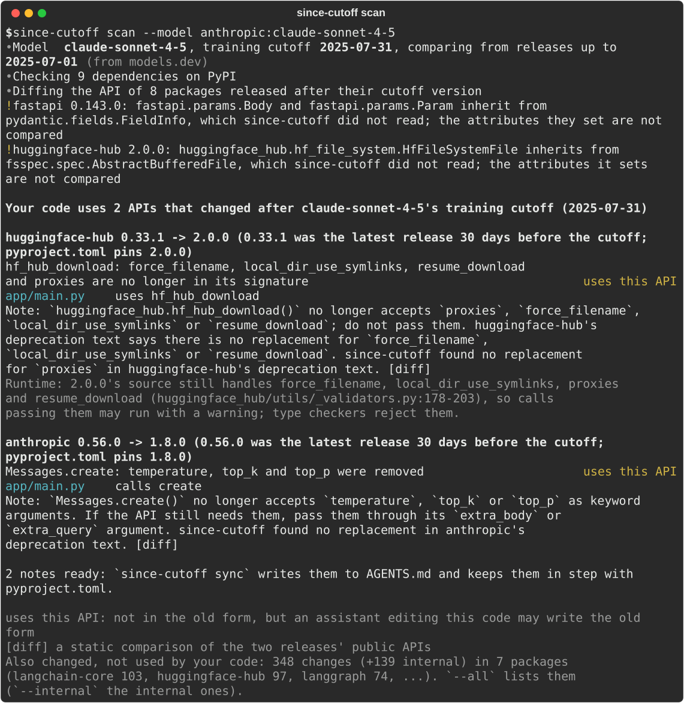
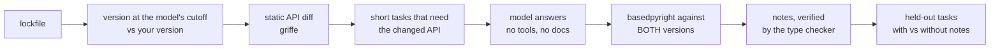

# since-cutoff

English | [简体中文](README.zh-CN.md)

**Your coding agent learned your libraries before they changed.**
since-cutoff finds exactly which APIs of *your* dependency versions it gets wrong, and fixes
them with a small AGENTS.md note that is checked by a type checker, not by another LLM.

[](https://github.com/MohammadHijjawi97/since-cutoff/actions/workflows/ci.yml)

[](LICENSE)

<p align="center"></p>

## The problem

Every model has a training cutoff. Your lockfile does not. A few real examples for a model
with a July 2025 cutoff (Claude Sonnet 4.5) and current releases, found by `since-cutoff scan`:

| library | version the model saw | your version | what breaks |
|---|---|---|---|
| anthropic | 0.60.0 | 1.8.0 | `messages.create(temperature=..., top_p=..., top_k=...)` no longer accepted |
| huggingface-hub | 0.34.3 | 2.0.0 | `hf_hub_download(resume_download=..., force_filename=..., local_dir_use_symlinks=...)` removed |
| langchain-core | 0.3.72 | 1.6.5 | `retriever.get_relevant_documents()`, `llm.predict()` removed |
| openai | 1.98.0 | 3.19.2 | 26 breaking changes, 6 new deprecations |

For that sample project, 7 of 9 dependencies had changed their public API after the cutoff:
483 breaking changes in total. An agent that learned the old API writes code that fails at
import or call time, or, worse, still runs because the old path is only deprecated.

Documentation tools paste whole docs into the context and hope. since-cutoff **measures**
which of those changes your model actually gets wrong, writes **only** the notes that are
needed, and **proves** on held-out tasks that the notes fix them.

## Quick start

```bash
# list API changes since your model's cutoff (fast, no model calls)
uvx --from git+https://github.com/MohammadHijjawi97/since-cutoff since-cutoff scan

# probe the model, write verified notes, and apply them to AGENTS.md
uvx --from git+https://github.com/MohammadHijjawi97/since-cutoff since-cutoff run --apply
```

Or install it: `pipx install git+https://github.com/MohammadHijjawi97/since-cutoff`, then run
`since-cutoff`. Run it from your project root (anything with `uv.lock`, `poetry.lock`,
`pdm.lock`, `pylock.toml`, `Pipfile.lock`, `requirements*.txt`, `pyproject.toml` or a `.venv`).

### In Claude Code

```text
/plugin marketplace add MohammadHijjawi97/since-cutoff
/plugin install since-cutoff@since-cutoff
```

Then ask Claude to "check which of our dependencies you are out of date on", or run
`/since-cutoff:since-cutoff`. The skill runs the CLI; the measuring itself is done by a fresh,
tool-less copy of the model, so the agent cannot grade itself.

## What you get

`since-cutoff run` prints a card like this and writes `.since-cutoff/report.md` and
`results.json`:

```text
Stale API use in <n> of <m> probed dependencies
7 of 9 dependencies changed their API after the cutoff (483 breaking changes, 10 new deprecations)
Probed 30 API changes: <stale> stale · <wrong> wrong · <deprecated> deprecated · <correct> correct
Fix: <k> notes (all checked by the type checker), about <t> tokens
Held-out tasks correct without -> with notes: <before>% -> <after>%  (paired tasks, 95% CI)
```

and a block you can keep in `AGENTS.md` or `CLAUDE.md` (`--apply` writes it; `unapply` removes it):

```markdown
<!-- since-cutoff:start -->
## Library changes after the model's training cutoff

**anthropic 1.8.0**
- `client.messages.create(temperature=...)`: `temperature`, `top_p` and `top_k` were removed ...
<!-- since-cutoff:end -->
```

## Models

| `--model` | uses | needs |
|---|---|---|
| `claude-code` (default) | your Claude Code login (subscription or key), current model | the `claude` CLI |
| `claude-code:sonnet`, `claude-code:claude-haiku-4-5` | a specific Claude model | the `claude` CLI |
| `anthropic:<model>` | Anthropic API | `ANTHROPIC_API_KEY` |
| `openai:<model>` | OpenAI API | `OPENAI_API_KEY` |
| `openrouter:<vendor/model>` | OpenRouter | `OPENROUTER_API_KEY` |
| `deepseek:<model>` | DeepSeek API | `DEEPSEEK_API_KEY` |
| `ollama:<model>` | local Ollama | Ollama running |
| `openai-compatible:<model>` | any OpenAI-compatible server | `--base-url`, optional `OPENAI_API_KEY` |

Training cutoffs come from [models.dev](https://models.dev) (a snapshot is bundled for
offline use). `since-cutoff models sonnet` lists them; `--cutoff 2025-07` overrides.

## How it works



| outcome | meaning |
|---|---|
| **stale** | the code is valid for the version the model knew and invalid for yours, and the error involves an API that changed |
| **wrong** | invalid for your version, but not explained by a change (hallucinated or misused API) |
| **deprecated** | valid, but uses an API marked `@deprecated` in your version |
| **correct** | valid for your version and actually uses the changed API |
| untouched / off-task / invalid / error | not counted in any rate, and always reported |

Everything is scored by a type checker against the exact package versions, each in an isolated
environment with that package's own runtime dependencies. No LLM judges anything, and every
number traces back to `results.json`. Details: [docs/how-it-works.md](docs/how-it-works.md).

## Safe by design

- **Never executes code.** Package code is read statically (griffe with inspection off; only
  `.py`/`.pyi` files are extracted, with path and size checks). Model-written code is only
  type-checked.
- **Writes almost nothing.** Only `.since-cutoff/` (which ignores itself in git) and, with
  `--apply`, one marked block in `AGENTS.md`/`CLAUDE.md`. Everything else in that file is
  left byte-for-byte unchanged.
- **Stays on PyPI.** Git, path, workspace and private-index dependencies are never looked up on
  public PyPI by name.
- **Local and cached.** No telemetry. PyPI data, diffs, tasks and answers are cached, so
  re-runs are free and reproducible (`--fresh` asks the model again).

## Use in CI

```bash
since-cutoff run --quick --fail-on-stale --json > since-cutoff.json
```

Exit codes: `0` ok, `1` error (including "no model answer could be scored"), `2` usage error,
`3` stale API use found with `--fail-on-stale`.

## Limitations

- Python only for now. TypeScript (`.d.ts` diffs, `tsc`) is next.
- A type checker sees wrong names, wrong parameters and PEP 702 deprecations. It cannot see
  behaviour changes behind an unchanged signature, or deprecations that only warn at run time.
- Probes cover a ranked **sample** of the breaking changes (symbols your code already uses
  first), not all of them.
- "The version the model saw" is the newest release on or before the cutoff date. Models know
  recent releases less well, so real staleness can start earlier.
- Held-out tasks are paraphrases of the same change: they show that a note fixes *that* change,
  not that the model got better in general.

## Related work

- [Context7](https://github.com/upstash/context7) and similar tools retrieve current docs at
  answer time. since-cutoff is complementary: it measures what is actually wrong and keeps a
  small, verified note in the repo.
- [cutoff](https://github.com/sandeepsirodia/cutoff) probes a library you maintain;
  [postcut](https://github.com/justi/postcut) pastes changelogs since the cutoff.
- Built on [griffe](https://mkdocstrings.github.io/griffe/),
  [basedpyright](https://github.com/DetachHead/basedpyright), [models.dev](https://models.dev)
  and [rich](https://github.com/Textualize/rich).

## Contributing

Issues and pull requests are welcome; see [CONTRIBUTING.md](CONTRIBUTING.md). The offline test
suite runs the whole pipeline with a toy library and a scripted model, so no API key is needed.

## License

MIT © [Mohammad Hijjawi](https://github.com/MohammadHijjawi97)
