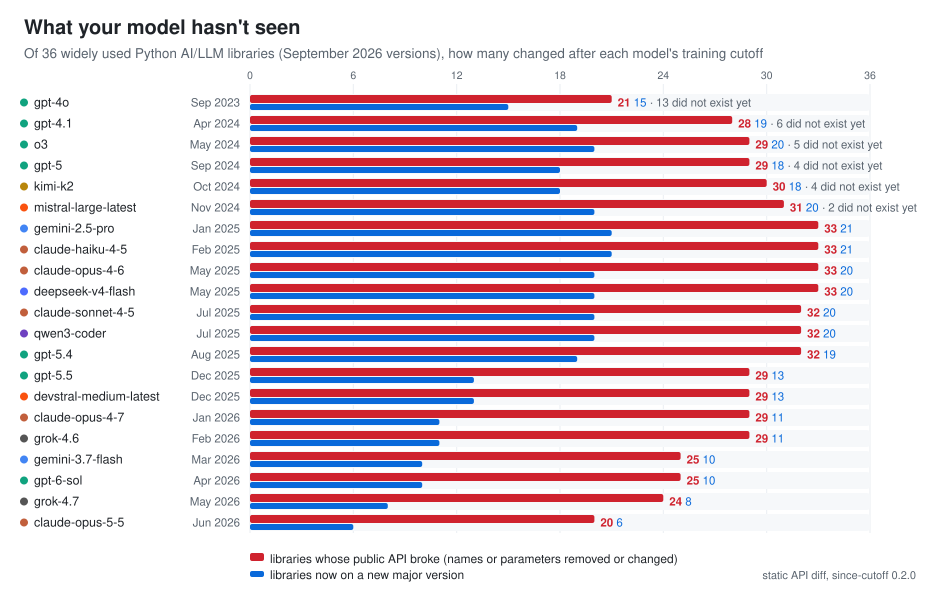

*The Python AI stack after each model's training cutoff · September 2026 ·
[since-cutoff on GitHub](https://github.com/MohammadHijjawi97/since-cutoff)*

A coding model knows each library as it was when its training data ends. The libraries keep
moving. To see how far, I pinned **36 widely used Python AI and LLM libraries** at their releases
of 26 September 2026
([the list](https://github.com/MohammadHijjawi97/since-cutoff/blob/main/examples/ai-stack/requirements.txt))
and ran `since-cutoff scan` (version 0.2.0) against the training cutoff of **21 models from 8
vendors**: OpenAI, Anthropic, Google, xAI, DeepSeek, Qwen, Moonshot and Mistral. For each
library, the scan takes the release that was current at the model's cutoff and diffs its public
API against the pinned release, statically. No model was called for this page.

<picture>
  <source media="(prefers-color-scheme: dark)" srcset="img/ai-stack-dark.svg">
  
</picture>

## What it shows

- **For every model, most of the stack changed its public API after the cutoff.** Even the
  newest model here, Claude Opus 5.5 (training cutoff June 2026), predates a public API break in
  **20 of the 36 libraries**, and 6 of them are on a new major version since: `openai` 2.44 →
  3.19, `anthropic` 0.115 → 1.8, `huggingface-hub` 1.21 → 2.0, `mcp` 1.28 → 2.2, `pinecone`
  9 → 10 and `sentence-transformers` 5 → 6.
- **Models with early-2025 cutoffs have the most to catch up on.** For Gemini 2.5 Pro and Claude
  Haiku 4.5 (cutoffs January and February 2025), 33 of the 36 libraries broke their public API
  since, and 21 are on a new major version, including `openai`, `anthropic`, `langchain`,
  `langgraph`, `transformers`, `pandas` and `huggingface-hub`.
- **Older models count lower because much of the stack did not exist yet.** GPT-4o's training
  data (September 2023) predates any release of 13 of the 36 packages under their current names,
  among them `langgraph`, `mcp`, `crewai`, `smolagents` and `google-genai`. A model cannot write
  stale code for a library it has never seen, but it cannot write correct code for it either.

## By model

| model | vendor | training cutoff | new release since (of 36) | did not exist yet | new major version | public API breaks | new deprecations |
|---|---|---|---|---|---|---|---|
| gpt-4o | OpenAI | 2023-09-30 | 36 | 13 | 15 | 21 | 6 |
| gpt-4.1 | OpenAI | 2024-04-30 | 36 | 6 | 19 | 28 | 11 |
| o3 | OpenAI | 2024-05-31 | 36 | 5 | 20 | 29 | 12 |
| gpt-5 | OpenAI | 2024-09-30 | 36 | 4 | 18 | 30 | 12 |
| kimi-k2 | Moonshot | 2024-10-31 | 36 | 4 | 18 | 30 | 12 |
| mistral-large-latest | Mistral | 2024-11-30 | 36 | 2 | 20 | 31 | 13 |
| gemini-2.5-pro | Google | 2025-01-31 | 35 | 0 | 21 | 33 | 13 |
| claude-haiku-4-5 | Anthropic | 2025-02-28 | 35 | 0 | 21 | 33 | 13 |
| claude-opus-4-6 | Anthropic | 2025-05-31 | 35 | 0 | 20 | 33 | 14 |
| deepseek-v4-flash | DeepSeek | 2025-05-31 | 35 | 0 | 20 | 33 | 14 |
| claude-sonnet-4-5 | Anthropic | 2025-07-31 | 35 | 0 | 20 | 32 | 15 |
| qwen3-coder | Qwen | 2025-07-31 | 35 | 0 | 20 | 32 | 15 |
| gpt-5.4 | OpenAI | 2025-08-31 | 35 | 0 | 19 | 32 | 14 |
| gpt-5.5 | OpenAI | 2025-12-01 | 34 | 0 | 13 | 29 | 13 |
| devstral-medium-latest | Mistral | 2025-12-31 | 34 | 0 | 13 | 29 | 12 |
| claude-opus-4-7 | Anthropic | 2026-01-31 | 34 | 0 | 11 | 29 | 12 |
| grok-4.6 | xAI | 2026-02-01 | 34 | 0 | 11 | 29 | 12 |
| gemini-3.7-flash | Google | 2026-03-31 | 34 | 0 | 10 | 25 | 12 |
| gpt-6-sol | OpenAI | 2026-04-20 | 34 | 0 | 10 | 25 | 11 |
| grok-4.7 | xAI | 2026-05-31 | 31 | 0 | 8 | 24 | 11 |
| claude-opus-5-5 | Anthropic | 2026-06-30 | 31 | 0 | 6 | 20 | 9 |

"New release since" includes the libraries that did not exist yet. "Public API breaks" counts
libraries with at least one public name or parameter removed, moved, newly required or changed
in kind; "new deprecations" counts libraries that newly mark a public API as deprecated.

## What this does and does not say

- **It counts libraries, not mistakes.** A library with a flagged break is one where code written
  from the model's memory *can* fail; whether a model actually writes the old call is what
  `since-cutoff run` measures, per project. On one sample project, measured with since-cutoff
  0.1.0, Claude Haiku 4.5 and Claude Opus 4.6 wrote stale code (valid for the version they
  learned, broken for the pinned one) for 3 of 5 and 2 of 4 probed libraries
  ([results](https://github.com/MohammadHijjawi97/since-cutoff#results)).
- **It is a static diff.** It sees names, parameters and deprecation markers in the public API,
  not behaviour changes behind an unchanged signature. Large libraries such as `transformers`
  report many changes, so this page counts libraries rather than changes.
- **Cutoff dates come from [models.dev](https://models.dev).** Vendors define them differently
  (Anthropic, for example, publishes both a "reliable knowledge" and a later "training data"
  cutoff), and models know the last months before their cutoff poorly, so the real gap can
  start earlier than the date suggests.
- **"Did not exist yet" means no release under that PyPI name before the cutoff.** Some
  projects existed under another name (`dspy` was `dspy-ai`).

## Reproduce it

The pinned requirements file and the script that builds this page's table and chart are in
[`examples/ai-stack`](https://github.com/MohammadHijjawi97/since-cutoff/tree/main/examples/ai-stack).
No API key is needed: `scan` makes no model calls.

```bash
pip install since-cutoff
cd examples/ai-stack
mkdir -p scans
since-cutoff scan --model openai:gpt-5 --json > scans/gpt-5.json
since-cutoff scan --model anthropic:claude-opus-5-5 --json > scans/claude-opus-5-5.json
python stack_report.py scans      # writes stack.md, stack.json and the two chart SVGs
```

Your own project is the more useful test: `uvx since-cutoff scan` in its root shows what your
model has not seen, and the
[MCP server](https://github.com/MohammadHijjawi97/since-cutoff#use-it-from-any-agent-mcp) lets
your agent ask before it writes the code.
