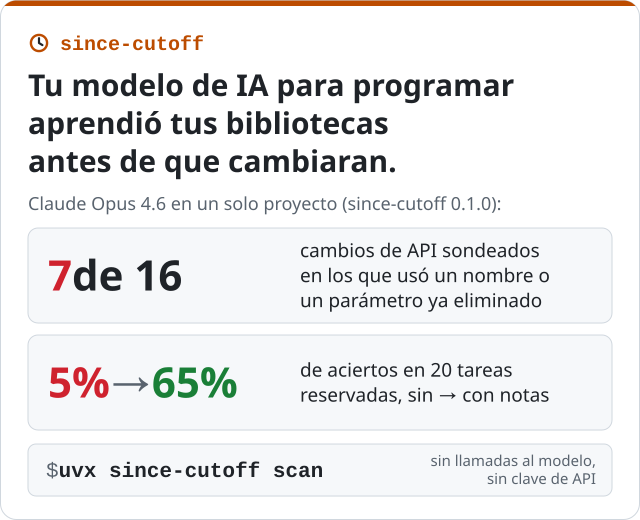

[English](../index.md) · **Español** · [Français](../fr/index.md)

*Mohammad Hijjawi · septiembre de 2026 · [since-cutoff en GitHub](https://github.com/MohammadHijjawi97/since-cutoff)*

<p align="center"></p>

**since-cutoff** es una herramienta de línea de comandos de código abierto y un servidor MCP para
proyectos de Python escritos con agentes de programación. Enumera los cambios que ha tenido la API
pública de tus dependencias, en las versiones que tienes fijadas, desde la fecha de corte de
entrenamiento del modelo; mide en cuáles se equivoca el modelo y escribe notas breves en
AGENTS.md, cada una comprobada con un verificador de tipos o tomada directamente del diff de la
API.

```bash
# qué ha cambiado desde la fecha de corte de tu modelo (sin llamadas al modelo, sin clave de API)
uvx since-cutoff scan

# medir el modelo, escribir notas verificadas y añadirlas a AGENTS.md
uvx since-cutoff run --apply
```

[Código fuente y documentación en GitHub](https://github.com/MohammadHijjawi97/since-cutoff/blob/main/README.es.md) ·
[PyPI](https://pypi.org/project/since-cutoff/) ·
[Cómo funciona, en detalle (en inglés)](https://github.com/MohammadHijjawi97/since-cutoff/blob/main/docs/how-it-works.md)

El resto de esta página cuenta cómo surgió la herramienta y presenta las primeras mediciones.

---

Todo modelo de IA para programar tiene una fecha de corte de entrenamiento. Tu lockfile no. Cuando una
biblioteca cambia su API pública después de esa fecha, un modelo que aprendió la versión anterior
sigue escribiendo las llamadas antiguas, y nada en el prompt le indica lo contrario.

Quería una cifra en lugar de una anécdota: **en un proyecto real, ¿con cuáles de las versiones
exactas de dependencias que fija se equivoca el modelo, y basta una nota breve para corregir el
error?**
[since-cutoff](https://github.com/MohammadHijjawi97/since-cutoff) es la herramienta que construí
para responder a esa pregunta.

## El experimento

El proyecto de ejemplo ([`examples/agent-app`](https://github.com/MohammadHijjawi97/since-cutoff/tree/main/examples/agent-app))
es una pequeña aplicación basada en agentes con nueve dependencias. Seis están fijadas en
versiones actuales (anthropic 1.8.0, openai 3.19.2, huggingface-hub 2.0.0, langchain-core 1.6.5,
langgraph 1.2.12 y pydantic 2.13.5); las otras tres no están fijadas (fastapi, requests y httpx),
así que la herramienta usa su versión más reciente.

Se evaluaron dos modelos: **Claude Haiku 4.5** (fecha de corte de entrenamiento: febrero de 2025)
y **Claude Opus 4.6** (mayo de 2025). Las tareas y las notas las escribió Claude Opus 4.6.

## Cómo mide

1. **Qué cambió.** Para cada dependencia, se toma la versión más reciente publicada en la fecha de
   corte del modelo o antes, y se compara su API pública con la versión fijada, de forma estática
   (con griffe, sin importar ningún módulo del paquete). Así se detectan objetos eliminados o
   movidos, parámetros eliminados o que pasan a ser obligatorios, parámetros que pasan a ser solo
   de palabra clave o solo posicionales, y nuevas marcas de obsolescencia. Para este proyecto y la fecha de corte de Claude
   Haiku 4.5, cambiaron 7 de las 9 dependencias; el diff actual (0.2.0) señala 491 cambios
   incompatibles y 50 obsolescencias nuevas, algunos de ellos en elementos internos.
2. **Tareas que requieren el cambio.** Para los cambios de mayor prioridad, un modelo redactor de
   tareas genera tareas de programación breves y realistas que requieren la funcionalidad modificada,
   pero sin nombrar nunca el identificador que cambió ni su sustituto. Una tarea es el sondeo; las
   otras dos se reservan (*held-out*).
3. **Respuestas sin nada que consultar.** El modelo recibe la tarea y el número de la versión
   fijada, sin herramientas, sin web y sin archivos del proyecto.
4. **Puntuación con un verificador de tipos, dos veces.** La respuesta se verifica con
   basedpyright frente a la versión que el modelo pudo haber visto y frente a la versión fijada,
   cada una en un entorno aislado con sus propias dependencias. Solo cuentan los errores de
   conocimiento de la API (nombres, importaciones y parámetros desconocidos, argumentos que
   faltan, aridad), nunca los avisos del modo estricto de tipado.
   - **stale**: válida para la versión que conocía el modelo, inválida para la fijada
   - **wrong**: inválida, y no se explica por el cambio de versión
   - **deprecated**: válida, pero usa una API marcada con `@deprecated` en la versión fijada
5. **Corrección y verificación.** Para cada fallo se escribe una nota de una línea para
   AGENTS.md. Una nota escrita por el modelo solo se conserva si su ejemplo pasa la verificación
   de tipos con la versión fijada y si todas las API que recomienda aparecen en ese ejemplo; si
   no, la nota es una descripción del cambio tomada directamente del diff de la API. Después, las
   tareas reservadas se responden de nuevo, sin las notas y con ellas, y se comparan por pares.

Nunca se ejecuta el código generado.

## Resultados

Estas ejecuciones se hicieron con since-cutoff 0.1.0 y en un único proyecto, el descrito arriba.

| | Claude Haiku 4.5 | Claude Opus 4.6 |
|---|---|---|
| fecha de corte de entrenamiento | febrero de 2025 | mayo de 2025 |
| cambios de API sondeados | 20 | 16 |
| **stale** / wrong / deprecated / correct | **5** / 1 / 2 / 12 | **7** / 0 / 3 / 6 |
| bibliotecas con uso desactualizado | 3 de 5 sondeadas | 2 de 4 sondeadas |
| notas escritas (comprobadas con el verificador de tipos) | 8 (7), unos 391 tokens | 10 (7), unos 437 tokens |
| **aciertos en tareas reservadas, sin -> con notas** | **14% -> 57%** (14 pares) | **5% -> 65%** (20 pares) |
| API que el modelo ya usaba bien, con las notas | 6/6 siguen bien | 6/6 siguen bien |

En esta muestra, el modelo más potente no resultó más fiable. Opus 4.6 tiene una fecha de corte
posterior y, aun así, escribió código desactualizado con más frecuencia:
`anthropic.HUMAN_PROMPT` con `client.completions`, `hf_hub_download(force_filename=...)`,
`resume_download=...`.

Más código desactualizado de la ejecución con Haiku, en cada caso válido en la versión que aprendió
el modelo y roto en la fijada:

- `client.messages.create(..., temperature=...)`: eliminado en anthropic 1.8
- `hf_hub_download(..., resume_download=True)`, `local_dir_use_symlinks=...` y `proxies=...`:
  eliminados en huggingface-hub 2.0
- `client.beta.vector_stores`: una API de openai 1.x que la 3.x trasladó a `client.vector_stores`

### ¿Lo corrige una nota?

since-cutoff escribió **8 notas, unos 391 tokens**, 7 de ellas comprobadas con el verificador de
tipos (en un caso se recurrió a una simple afirmación extraída del diff de la API). Por ejemplo:

```markdown
**anthropic 1.8.0**
- `temperature=...` was removed from `messages.create()` in anthropic 1.8.0. Omit the `temperature` parameter entirely; there is no replacement.

**openai 3.19.2**
- `client.beta.vector_stores` is removed in openai 3.19.2. Use `client.vector_stores` instead.
```

En las tareas reservadas de los cambios en los que había fallado, el modelo acertó en el
**14 % sin las notas y en el 57 % con ellas** (14 tareas emparejadas de 7 cambios de API). La
tarjeta de la ejecución también indica «4 of 7 changes fixed, 95% CI 25-84%»: es el recuento de
la versión 0.1.0, que también contaba un cambio como corregido cuando una respuesta reservada ya
era correcta sin las notas, y el intervalo corresponde a ese recuento, no a las dos tasas. El
modelo siguió usando bien, con las notas en su contexto, las seis API que ya acertaba.

## Qué dicen y qué no dicen estas cifras

- **Muestra pequeña.** Dos modelos, un proyecto, 16-20 sondeos cada uno. Es la demostración de un
  método, no un benchmark. El intervalo de confianza es amplio porque la muestra es pequeña.
- **Una muestra de los cambios, no todos.** Los sondeos se ordenan por prioridad (primero las API
  que usa el propio código del proyecto, y los cambios que rompen el código antes que los más
  leves); el redactor de tareas también omite los elementos internos.
- **Lo que puede ver un verificador de tipos.** Nombres, parámetros y aridad incorrectos, y
  obsolescencias de la PEP 702. Los cambios de comportamiento que mantienen la misma firma son
  invisibles.
- **Las tareas reservadas son paráfrasis sobre el mismo cambio,** así que el antes y el después
  miden si una nota corrige *ese* cambio, no la capacidad general.
- **«La versión que vio el modelo» es una regla basada en fechas** (la versión más reciente
  anterior a la fecha de corte). Los modelos conocen mal los meses inmediatamente anteriores a su
  fecha de corte, así que la desactualización real puede empezar antes.

## Por qué me importa

Esto surgió de un artículo que coescribí para EMNLP 2026 sobre el *aislamiento temporal*
(*temporal isolation*): usar la fecha de corte de entrenamiento de un modelo como experimento
natural sobre lo que sabe. Las nuevas versiones de las bibliotecas son el mismo experimento, con
una utilidad muy práctica: la respuesta es una lista de líneas para poner en AGENTS.md.

## Pruébalo

```bash
# qué ha cambiado desde la fecha de corte de tu modelo (sin llamadas al modelo)
uvx since-cutoff scan

# medir, escribir notas verificadas y aplicarlas a AGENTS.md
uvx since-cutoff run --apply
```

Funciona con Claude Code (como plugin), Anthropic, OpenAI, OpenRouter, DeepSeek, Ollama y
cualquier servidor compatible con OpenAI.
`since-cutoff mcp` permite a cualquier cliente MCP (Codex, Cursor, VS Code, Gemini CLI) consultar
los cambios de una biblioteca antes de escribir código, y una
[GitHub Action](https://github.com/MohammadHijjawi97/since-cutoff/blob/main/README.es.md#github-action)
ejecuta el análisis en las pull requests. Por ahora solo admite Python; TypeScript es lo
siguiente. Los comentarios sobre el método son muy bienvenidos en los
[issues](https://github.com/MohammadHijjawi97/since-cutoff/issues), y los resultados de tus
propios proyectos, en
[Share your results](https://github.com/MohammadHijjawi97/since-cutoff/discussions/6)
(«Comparte tus resultados», en inglés). Si quieres
contribuir con código, los
[good first issues](https://github.com/MohammadHijjawi97/since-cutoff/labels/good%20first%20issue)
son un buen punto de partida.
