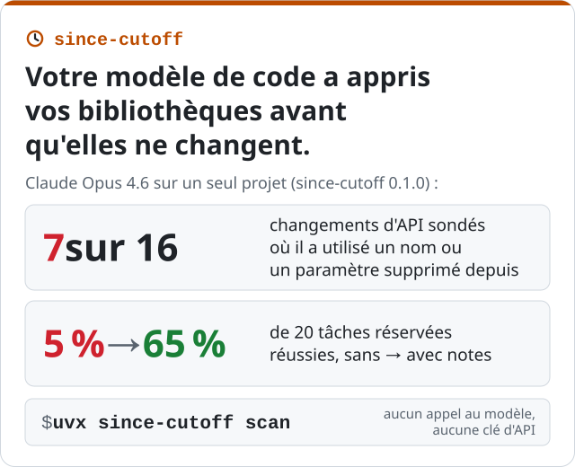

[English](../index.md) · [Español](../es/index.md) · **Français**

*Mohammad Hijjawi · septembre 2026 · [since-cutoff sur GitHub](https://github.com/MohammadHijjawi97/since-cutoff)*

<p align="center"></p>

**since-cutoff** est un outil open source, utilisable en ligne de commande et comme serveur MCP,
pour les projets Python écrits avec des agents de code. Il liste les changements d'API publique
survenus dans vos dépendances épinglées depuis la date limite d'entraînement du modèle et montre
où votre code utilise les API qui ont changé ; il rédige de courtes notes AGENTS.md sur ces
changements à partir du diff d'API et les tient à jour avec votre fichier de verrouillage, et
peut mesurer ceux sur lesquels le modèle se trompe et si les notes l'aident. Chaque note porte une
étiquette qui dit ce qui a été vérifié : énoncée à partir du diff d'API, ou rédigée par le modèle
et conservée seulement si son exemple passe le vérificateur de types pour votre version.

```bash
# les API modifiées qu'utilise votre code, avec une note pour chacune (aucun appel au modèle, aucune clé d'API)
uvx since-cutoff scan

# écrire les notes dans AGENTS.md et les tenir à jour (aucun appel au modèle)
uvx since-cutoff sync

# mesurer le modèle, rédiger des notes, les ajouter à AGENTS.md
uvx --with basedpyright since-cutoff run --apply
```

[Documentation en français et code source sur GitHub](https://github.com/MohammadHijjawi97/since-cutoff/blob/main/README.fr.md) ·
[PyPI](https://pypi.org/project/since-cutoff/) ·
[Le fonctionnement en détail (en anglais)](https://github.com/MohammadHijjawi97/since-cutoff/blob/main/docs/how-it-works.md)

La suite de cette page raconte l'origine du projet et présente les premières mesures.

---

Chaque modèle de code a une date limite d'entraînement. Votre fichier de verrouillage, non. Quand
une bibliothèque modifie son API publique après cette date, un modèle qui a appris l'ancienne
version continue d'écrire les anciens appels, et rien dans le prompt ne lui indique le contraire.

Je voulais un chiffre plutôt qu'une anecdote : **pour un vrai projet et les versions exactes des
dépendances qu'il épingle, sur lesquelles le modèle se trompe-t-il, et une courte note
règle-t-elle le problème ?** [since-cutoff](https://github.com/MohammadHijjawi97/since-cutoff) est l'outil que
j'ai construit pour y répondre.

## Le dispositif

Le projet d'exemple ([`examples/agent-app`](https://github.com/MohammadHijjawi97/since-cutoff/tree/main/examples/agent-app))
est une petite application d'agent qui a neuf dépendances. Six sont épinglées sur les versions
actuelles (anthropic 1.8.0, openai 3.19.2, huggingface-hub 2.0.0, langchain-core 1.6.5,
langgraph 1.2.12 et pydantic 2.13.5) ; les trois autres ne le sont pas (fastapi, requests et
httpx), et l'outil utilise donc leur dernière version.

Deux modèles ont été testés : **Claude Haiku 4.5** (date limite d'entraînement : février 2025)
et **Claude Opus 4.6** (mai 2025). Les tâches et les notes ont été rédigées par Claude Opus 4.6.

## La méthode de mesure

1. **Ce qui a changé.** Pour chaque dépendance, on prend la version la plus récente publiée au
   plus tard à la date limite du modèle, et on compare son API publique à celle de la version
   épinglée, de façon statique (griffe, aucun code importé). On trouve ainsi les objets supprimés
   ou déplacés, les paramètres supprimés ou devenus obligatoires, les passages en paramètres
   nommés uniquement ou positionnels uniquement (keyword-only, positional-only) et les nouveaux
   marqueurs de dépréciation. Pour ce projet et la date limite de
   Claude Haiku 4.5, 7 des 9 dépendances ont changé ; le diff actuel (0.2.0) signale 491
   changements incompatibles et 50 nouvelles dépréciations, dont une partie concerne des éléments
   internes.
2. **Des tâches qui nécessitent le changement.** Pour les changements les mieux classés, un
   rédacteur de tâches produit de courtes tâches de programmation réalistes, qui exigent la
   fonctionnalité modifiée sans jamais nommer l'identifiant modifié ni ce qui le remplace. Une
   tâche sert de sonde ; deux sont réservées (held-out).
3. **Des réponses sans rien à consulter.** Le modèle reçoit la tâche et le numéro de la version
   épinglée, sans outils, sans accès au web, sans fichiers du projet.
4. **Une évaluation par un vérificateur de types, à deux reprises.** La réponse est vérifiée avec
   basedpyright par rapport à la version de comparaison (la plus récente à la date limite du
   modèle), puis par rapport à la version épinglée, chacune dans un environnement isolé avec ses propres dépendances. Seules comptent les
   erreurs de connaissance de l'API (noms, imports et paramètres inconnus, arguments manquants,
   arité), jamais les remarques liées à la rigueur du typage.
   - **stale** : valide pour la version de comparaison, invalide pour la version épinglée
   - **wrong** : invalide, sans que le changement de version l'explique
   - **deprecated** : valide, mais utilise une API marquée `@deprecated` dans la version épinglée
5. **Rédaction et test des notes.** Pour chaque échec, une note d'une ligne est rédigée pour
   AGENTS.md. Une note rédigée par le modèle n'est conservée que si son exemple passe la
   vérification de types avec la version épinglée et si chaque API qu'elle recommande figure dans
   cet exemple ; sinon, la note est un simple constat du changement tiré du diff d'API. Le modèle
   répond ensuite
   à nouveau, cette fois aux tâches réservées, sans puis avec les notes, et les réponses sont
   comparées paire par paire.

Aucun code généré n'est jamais exécuté.

## Résultats

Ces exécutions ont été réalisées avec since-cutoff 0.1.0, sur le seul projet décrit ci-dessus.

| | Claude Haiku 4.5 | Claude Opus 4.6 |
|---|---|---|
| date limite d'entraînement | févr. 2025 | mai 2025 |
| changements d'API sondés | 20 | 16 |
| **stale** / wrong / deprecated / correct | **5** / 1 / 2 / 12 | **7** / 0 / 3 / 6 |
| bibliothèques avec des appels *stale* | 3 sur 5 sondées | 2 sur 4 sondées |
| notes rédigées (dont avec un exemple qui passe le vérificateur de types) | 8 (7), environ 391 jetons | 10 (7), environ 437 jetons |
| **tâches réservées correctes, sans -> avec notes** | **14 % -> 57 %** (14 paires) | **5 % -> 65 %** (20 paires) |
| API déjà correctes, une fois les notes ajoutées | 6/6 toujours correctes | 6/6 toujours correctes |

Dans cet échantillon, le modèle le plus puissant n'était pas plus sûr. Opus 4.6 a une date
limite plus tardive et a pourtant écrit du code périmé plus souvent :
`anthropic.HUMAN_PROMPT` avec `client.completions`, `hf_hub_download(force_filename=...)`,
`resume_download=...`.

D'autres exemples de code périmé tirés de l'exécution Haiku, chacun valide pour la version de
comparaison et rejeté par le vérificateur de types dans la version épinglée :

- `client.messages.create(..., temperature=...)` : supprimé dans anthropic 1.8, qui lève
  `TypeError` si on le passe
- `hf_hub_download(..., resume_download=True)`, `local_dir_use_symlinks=...` et `proxies=...` :
  retirés de la signature depuis huggingface-hub 1.0 ; la 2.0 les accepte encore à l'exécution,
  les ignore et émet un avertissement
- `client.beta.vector_stores` : une API d'openai 1.x que la 3.x a déplacée vers
  `client.vector_stores`

### Une note suffit-elle ?

since-cutoff a rédigé **8 notes, environ 391 jetons**, dont 7 avec un exemple qui passe le
vérificateur de types (pour la huitième, l'outil s'est rabattu sur un simple constat tiré du diff d'API). Par
exemple (texte original) :

```markdown
**anthropic 1.8.0**
- `temperature=...` was removed from `messages.create()` in anthropic 1.8.0. Omit the `temperature` parameter entirely; there is no replacement.

**openai 3.19.2**
- `client.beta.vector_stores` is removed in openai 3.19.2. Use `client.vector_stores` instead.
```

Sur les tâches réservées des changements où il avait échoué, le modèle a répondu correctement
dans **14 % des cas sans les notes et dans 57 % avec** (14 tâches appariées, issues de 7
changements d'API). La carte de l'exécution indique aussi « 4 of 7 changes fixed, 95% CI
25-84% » : c'est le décompte de la 0.1.0, qui comptait aussi un changement comme corrigé quand
une réponse réservée était déjà correcte sans les notes, et l'intervalle porte sur ce décompte,
pas sur les deux taux. Les six API qu'il maîtrisait déjà sont restées correctes avec les notes
dans son contexte.

## Ce que ces chiffres disent, et ne disent pas

- **Petit échantillon.** Deux modèles, un projet, 16 à 20 sondes chacun. C'est la démonstration
  d'une méthode, pas un benchmark. L'intervalle de confiance est large parce que l'échantillon
  est petit.
- **Un échantillon de changements, pas leur totalité.** Les sondes sont classées (les API
  qu'utilise le code du projet d'abord, les incompatibilités franches avant les plus légères) ;
  le rédacteur de tâches ignore aussi les éléments internes.
- **Ce qu'un vérificateur de types peut voir.** Noms, paramètres et arité erronés, et
  dépréciations PEP 702. Les changements de comportement derrière une signature inchangée lui
  échappent.
- **Les tâches réservées sont des reformulations du même changement** : la comparaison
  avant/après mesure donc si une note corrige *ce* changement, pas une capacité générale.
- **« La version de comparaison » découle d'une règle de date** (la version la plus récente
  publiée au plus tard à la date limite). Les modèles connaissent mal les mois qui précèdent immédiatement leur
  date limite, si bien que leurs connaissances peuvent être périmées plus tôt.

## Pourquoi ce sujet m'intéresse

Ce projet est né d'un article que j'ai coécrit pour EMNLP 2026 sur l'*isolement temporel*
(*temporal isolation*) : utiliser la date limite d'entraînement d'un modèle comme une expérience
naturelle sur ce qu'il sait. Les versions des bibliothèques relèvent de la même expérience, avec
un bénéfice très concret : la réponse est une liste de lignes à mettre dans AGENTS.md.

## Essayer

```bash
# les API modifiées qu'utilise votre code, avec une note pour chacune (aucun appel au modèle)
uvx since-cutoff scan

# écrire les notes dans AGENTS.md et les tenir à jour (aucun appel au modèle)
uvx since-cutoff sync

# mesurer, rédiger des notes, les appliquer à AGENTS.md
uvx --with basedpyright since-cutoff run --apply
```

since-cutoff fonctionne avec Claude Code (sous forme de plugin), Anthropic, OpenAI, OpenRouter,
DeepSeek, Ollama et tout serveur compatible OpenAI. `since-cutoff mcp` permet à n'importe quel
client MCP (Codex, Cursor, VS Code, Gemini CLI) de consulter les changements d'une bibliothèque
avant d'écrire du code, et une
[action GitHub](https://github.com/MohammadHijjawi97/since-cutoff/blob/main/README.fr.md#github-action)
lance le scan sur les pull requests et peut vérifier que les notes sont à jour. Il ne prend en charge que Python pour l'instant ; TypeScript
est la prochaine étape. Vos retours sur la méthode sont les bienvenus dans les
[issues](https://github.com/MohammadHijjawi97/since-cutoff/issues), tout comme les résultats
obtenus sur vos propres projets dans
[Share your results](https://github.com/MohammadHijjawi97/since-cutoff/discussions/6)
(« Partagez vos résultats », en anglais). Si vous
souhaitez contribuer au code, les
[good first issues](https://github.com/MohammadHijjawi97/since-cutoff/labels/good%20first%20issue)
sont un bon point de départ.
