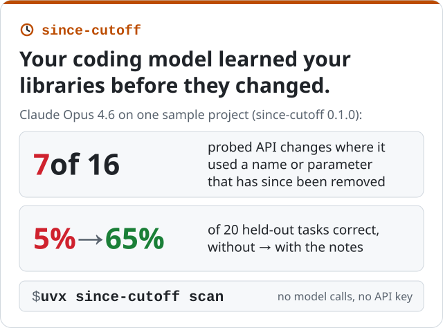

**English** · [Español](es/index.md) · [Français](fr/index.md)

*Mohammad Hijjawi · September 2026 · [since-cutoff on GitHub](https://github.com/MohammadHijjawi97/since-cutoff)*

<p align="center"></p>

**since-cutoff** is an open-source command-line tool and MCP server for Python projects written
with coding agents. It shows where your code uses a dependency API that changed after the
model's training cutoff, writes short AGENTS.md notes about those changes from the API diff and
keeps them in step with your lockfile, and can measure which of the changes the model gets wrong
and whether the notes help. Each note is tagged with what was checked: stated from the API diff,
or written by the model and kept only if its example type-checks against your version.

```bash
# the changed APIs your code uses, with a note for each (no model calls, no API key)
uvx since-cutoff scan

# write the notes into AGENTS.md and keep them current (no model calls)
uvx since-cutoff sync

# measure the model, write notes, add them to AGENTS.md
uvx --with basedpyright since-cutoff run --apply
```

[Source and documentation on GitHub](https://github.com/MohammadHijjawi97/since-cutoff) ·
[PyPI](https://pypi.org/project/since-cutoff/) ·
[How it works, in detail](https://github.com/MohammadHijjawi97/since-cutoff/blob/main/docs/how-it-works.md)

The rest of this page is the story behind it and the first measurements.

---

Every coding model has a training cutoff. Your lockfile doesn't. When a library changes its
public API after the cutoff, a model that learned the old version keeps writing the old calls,
and nothing in the prompt tells it otherwise.

I wanted a number for that instead of an anecdote: **for one real project, which of the exact
dependency versions it pins does the model get wrong, and does a short note fix it?**
[since-cutoff](https://github.com/MohammadHijjawi97/since-cutoff) is the tool I built to answer it.

## The setup

The sample project ([`examples/agent-app`](https://github.com/MohammadHijjawi97/since-cutoff/tree/main/examples/agent-app))
is a small agent app with nine dependencies. Six are pinned to current releases (anthropic
1.8.0, openai 3.19.2, huggingface-hub 2.0.0, langchain-core 1.6.5, langgraph 1.2.12 and
pydantic 2.13.5); three are unpinned (fastapi, requests and httpx), so the tool uses their
latest release.

Two models were tested: **Claude Haiku 4.5** (training cutoff February 2025) and **Claude Opus 4.6**
(May 2025). Tasks and notes were written by Claude Opus 4.6.

## How it measures

1. **What changed.** For each dependency, take the newest release published on or before the
   model's cutoff, and diff its public API against the pinned version, statically (griffe, no code
   imported). That finds removed and moved objects, removed or newly required parameters,
   keyword/positional-only changes and new deprecation markers. For this project and Claude
   Haiku 4.5's cutoff, 7 of the 9 dependencies changed; the current diff (0.2.0) flags 491
   breaking changes and 50 new deprecations, some of them internals.
2. **Tasks that need the change.** For the highest-ranked changes, a task writer produces short,
   realistic coding tasks that require the changed functionality but never name the changed
   identifier or its replacement. One task is the probe; two are held out.
3. **Answers with nothing to look things up in.** The model gets the task and the pinned version
   number, and no tools, no web, no project files.
4. **Scoring by a type checker, twice.** The answer is type-checked with basedpyright against the
   comparison release (the newest at the model's cutoff) and against the pinned version, each in
   an isolated environment with that version's own dependencies. Only API-knowledge errors count (unknown
   names, imports and parameters, missing arguments, arity), never type-strictness complaints.
   - **stale**: valid for the comparison release, invalid for the pinned one
   - **wrong**: invalid, and not explained by the version change
   - **deprecated**: valid, but uses an API marked `@deprecated` in the pinned version
5. **Write and test notes.** For each failure, a one-line note is written for AGENTS.md. A note
   written by the model is kept only if its example type-checks against the pinned version and
   every API it recommends appears in that example; otherwise the note is a plain statement of
   the change taken from the API diff. Then the held-out tasks are answered again, without and
   with the notes, and compared pair by pair.

No generated code is ever executed.

## Results

These runs were made with since-cutoff 0.1.0, on the one project above.

| | Claude Haiku 4.5 | Claude Opus 4.6 |
|---|---|---|
| training cutoff | Feb 2025 | May 2025 |
| API changes probed | 20 | 16 |
| **stale** / wrong / deprecated / correct | **5** / 1 / 2 / 12 | **7** / 0 / 3 / 6 |
| libraries with stale use | 3 of 5 probed | 2 of 4 probed |
| notes written (with an example that type-checks) | 8 (7), about 391 tokens | 10 (7), about 437 tokens |
| **held-out correct, without -> with notes** | **14% -> 57%** (14 pairs) | **5% -> 65%** (20 pairs) |
| previously-correct APIs after notes | 6/6 still correct | 6/6 still correct |

In this sample the stronger model was not safer. Opus 4.6 has a later cutoff and still wrote
stale code more often: `anthropic.HUMAN_PROMPT` with `client.completions`,
`hf_hub_download(force_filename=...)`, `resume_download=...`.

More stale code from the Haiku run, each valid for the comparison release and rejected by the
type checker for the pinned one:

- `client.messages.create(..., temperature=...)`: removed in anthropic 1.8, which raises
  `TypeError` for it
- `hf_hub_download(..., resume_download=True)`, `local_dir_use_symlinks=...` and `proxies=...`:
  no longer in the signature since huggingface-hub 1.0; 2.0 still accepts them at run time,
  ignores them and warns
- `client.beta.vector_stores`: an openai 1.x API that 3.x moved to `client.vector_stores`

### Does a note fix it?

since-cutoff wrote **8 notes, about 391 tokens**, 7 of them with an example that type-checks (one
fell back to a plain statement from the API diff). For example:

```markdown
**anthropic 1.8.0**
- `temperature=...` was removed from `messages.create()` in anthropic 1.8.0. Omit the `temperature` parameter entirely; there is no replacement.

**openai 3.19.2**
- `client.beta.vector_stores` is removed in openai 3.19.2. Use `client.vector_stores` instead.
```

On the held-out tasks for the changes it got wrong, the model was correct on **14% without the
notes and 57% with them** (14 paired tasks from 7 API changes). The run card also says "4 of 7
changes fixed, 95% CI 25-84%". That is 0.1.0's count, which also counted a change as fixed when a
held-out answer was already right without the notes, and the interval belongs to that count, not
to the two rates. The six APIs it already got right were still right with the notes in its
context.

## What these numbers do and don't say

- **Small sample.** Two models, one project, 16-20 probes each. It is a demonstration of a
  method, not a benchmark. The confidence interval is wide because the sample is small.
- **A sample of changes, not all of them.** Probes are ranked (APIs the project's own code uses
  first, hard breaks before soft ones); the task writer also skips internals.
- **What a type checker can see.** Wrong names, parameters, arity and PEP 702 deprecations.
  Behaviour changes behind an unchanged signature are invisible.
- **Held-out tasks are paraphrases of the same change,** so the before/after measures whether a
  note fixes *that* change, not general ability.
- **"The comparison release" is a date rule** (the newest release on or before the cutoff). Models know
  the months right before their cutoff poorly, so real staleness can begin earlier.

## Why I care about this

This grew out of a paper I co-authored for EMNLP 2026 on *temporal isolation*: using a model's
training cutoff as a natural experiment for what it knows. Library releases are the same
experiment with a very practical payoff: the answer is a list of lines to put in AGENTS.md.

## Try it

```bash
# the changed APIs your code uses, with a note for each (no model calls)
uvx since-cutoff scan

# write the notes into AGENTS.md and keep them current (no model calls)
uvx since-cutoff sync

# measure, write notes, apply them to AGENTS.md
uvx --with basedpyright since-cutoff run --apply
```

It works with Claude Code (as a plugin), Anthropic, OpenAI, OpenRouter, DeepSeek, Ollama and
any OpenAI-compatible server.
`since-cutoff mcp` lets any MCP client (Codex, Cursor, VS Code, Gemini CLI) look up a library's
changes before writing code, and a
[GitHub Action](https://github.com/MohammadHijjawi97/since-cutoff#github-action) runs the scan on
pull requests and can check that the notes are current. It is Python-only for now; TypeScript is next. Feedback on the method is very
welcome in the [issues](https://github.com/MohammadHijjawi97/since-cutoff/issues), and results
from your own projects in
[Share your results](https://github.com/MohammadHijjawi97/since-cutoff/discussions/6). If you
would like to contribute code, the
[good first issues](https://github.com/MohammadHijjawi97/since-cutoff/labels/good%20first%20issue)
are a good place to start.
